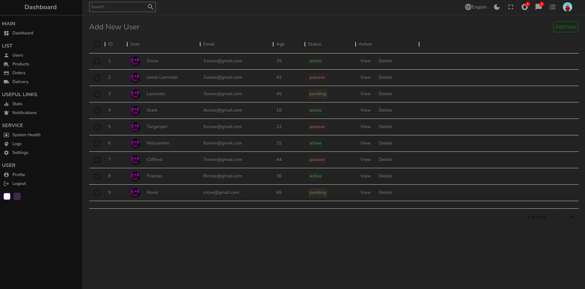
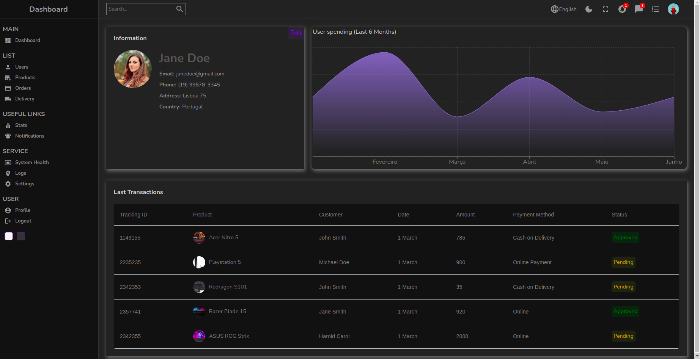

# Dashboard de gerenciamento para uma loja.

## Tela principal do projeto
<p align="center" >
    
    
</p>

---
## Tela de usuários:
<p align="center" >
    
    

</p>

---
## Tela de cadastro de usuário:
<p align="center" >
    
    

</p>

---
## Tela de perfil de um usuário:
<p align="center" >
    
    
</p>


# Como baixar:

```
    $ git clone https://github.com/Giovani2912/Dashboard

    $ cd Dashboard

# Caso esteja utilizando o npm

    $ npm install

    $ npm start

# Caso esteja utilizando o yarn

    $ yarn add

    $ yarn start